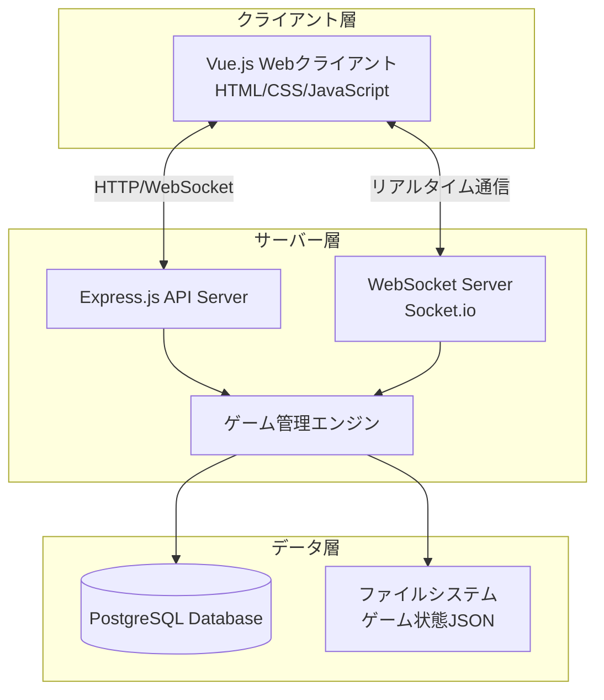

# 設計文書

## 概要

テラフォーミング・マーズゲーム管理システムは、Node.js ベースのサーバー・クライアントアーキテクチャを採用します。リアルタイム通信には WebSocket を使用し、ゲーム状態の永続化にはPostgreSQLを使用します。

## アーキテクチャ

### システム構成



### 技術スタック

**サーバーサイド:**

- Node.js (v18+)
- Express.js (RESTful API)
- Socket.io (WebSocket 通信)
- PostgreSQL (データ永続化)
- UUID (ゲーム ID 生成)

**クライアントサイド:**

- Vue.js 3 (Composition API)
- HTML5/CSS3
- Socket.io Client
- Axios (HTTP 通信)
- Pinia (状態管理)

## コンポーネントと インターフェース

### 1. ゲーム管理エンジン (GameManager)

```javascript
class GameManager {
  // ゲームセッション管理
  createGame(hostPlayerId)
  joinGame(gameId, playerId)
  startGame(gameId)
  endGame(gameId)

  // ターン管理
  nextTurn(gameId)
  nextGeneration(gameId)
  passPlayer(gameId, playerId)

  // 状態管理
  updatePlayerResources(gameId, playerId, resources)
  updatePlayerScore(gameId, playerId, scoreData)
  getGameState(gameId)
}
```

### 2. プレイヤー管理 (PlayerManager)

```javascript
class PlayerManager {
  createPlayer(name, color)
  updateResources(playerId, resourceType, amount)
  updateScore(playerId, scoreComponent, points)
  calculateTotalScore(playerId)
  getPlayerState(playerId)
}
```

### 3. WebSocket イベントハンドラー

```javascript
// サーバー側イベント
socket.on("join-game", (gameId, playerData));
socket.on("update-resources", (gameId, playerId, resources));
socket.on("update-score", (gameId, playerId, scoreData));
socket.on("next-turn", gameId);
socket.on("pass-turn", (gameId, playerId));

// クライアント側イベント
socket.emit("game-state-updated", gameState);
socket.emit("player-joined", playerData);
socket.emit("turn-changed", currentPlayer);
socket.emit("generation-changed", generation);
```

### 4. REST API エンドポイント

```
POST   /api/games              - 新しいゲーム作成
GET    /api/games/:id          - ゲーム状態取得
POST   /api/games/:id/join     - ゲーム参加
PUT    /api/games/:id/start    - ゲーム開始
DELETE /api/games/:id          - ゲーム削除

POST   /api/players            - プレイヤー作成
GET    /api/players/:id        - プレイヤー情報取得
PUT    /api/players/:id        - プレイヤー情報更新
```

## データモデル

### ゲーム状態 (GameState)

```javascript
{
  id: "uuid",
  status: "waiting|playing|finished",
  currentGeneration: 1,
  currentPlayerIndex: 0,
  players: [Player],
  globalParameters: {
    oxygen: 0,      // 0-14%
    temperature: -30, // -30 to +8°C
    oceans: 0       // 0-9
  },
  createdAt: "timestamp",
  updatedAt: "timestamp"
}
```

### プレイヤー状態 (Player)

```javascript
{
  id: "uuid",
  name: "string",
  color: "red|blue|green|yellow|black",
  resources: {
    megaCredits: 0,
    steel: 0,
    titanium: 0,
    plants: 0,
    energy: 0,
    heat: 0
  },
  production: {
    megaCredits: 0,
    steel: 0,
    titanium: 0,
    plants: 0,
    energy: 0,
    heat: 0
  },
  score: {
    terraformingRating: 20,
    awards: 0,
    milestones: 0,
    cards: 0,
    total: 20
  },
  hasPassed: false
}
```

## エラーハンドリング

### サーバーサイドエラー処理

1. **ゲーム状態エラー**

    - 存在しないゲーム ID へのアクセス
    - 無効なプレイヤー操作
    - ゲーム状態の不整合

2. **ネットワークエラー**

    - WebSocket 接続切断
    - HTTP リクエストタイムアウト
    - データベース接続エラー

3. **バリデーションエラー**
    - 無効な資源値
    - 範囲外のスコア値
    - 不正なターン操作

### クライアントサイドエラー処理

1. **接続エラー**

    - サーバー接続失敗時の再接続ロジック
    - オフライン状態の検出と通知

2. **UI エラー**
    - 無効な入力値の検証
    - エラーメッセージの表示
    - 操作失敗時のロールバック

## テスト戦略

### 単体テスト

- GameManager クラスのメソッド
- PlayerManager クラスのメソッド
- データモデルのバリデーション
- ユーティリティ関数

### 統合テスト

- WebSocket 通信フロー
- REST API エンドポイント
- データベース操作
- ゲーム状態の同期

### E2E テスト

- 完全なゲームセッションフロー
- 複数プレイヤーの同時操作
- 接続切断・再接続シナリオ
- ゲーム状態の永続化・復元

### テストツール

- Jest (単体・統合テスト)
- Supertest (API テスト)
- Socket.io-client (WebSocket テスト)
- Vitest (Vue.js コンポーネントテスト)
- Cypress (E2E テスト)

## セキュリティ考慮事項

1. **入力検証**

    - 全ての API 入力の検証
    - WebSocket メッセージの検証
    - SQL インジェクション対策

2. **認証・認可**

    - プレイヤー ID の検証
    - ゲームセッションへのアクセス制御
    - 操作権限の確認

3. **データ保護**
    - ゲーム状態の整合性保証
    - 不正な状態変更の防止
    - ログ記録とモニタリング
